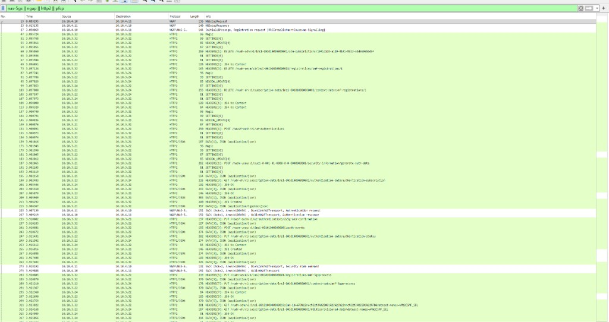
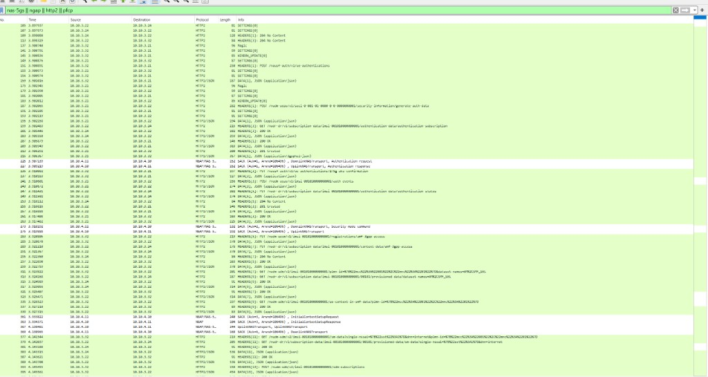
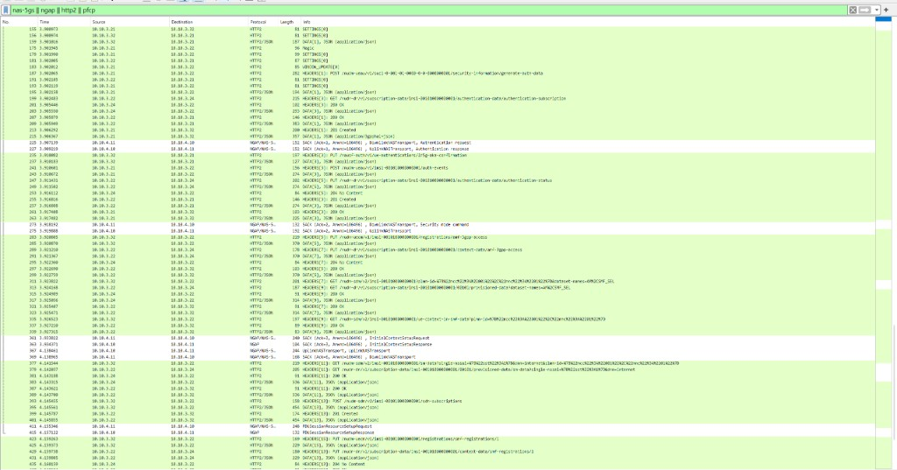

# NTN Roaming Lab (IREG-style)

### Software-only 5G SA home / visited / IPX gate — Open5GS + UERANSIM, TC-05 LBO **MEASURED**, Grafana flow


-C62828)

---

## Table of Contents

1. [Overview](#overview)
2. [Honesty first](#honesty-first)
3. [Architecture](#architecture)
4. [Golden result (TC-05)](#golden-result-tc-05)
5. [Demo snaps (W1–W8, G1–G7)](#demo-snaps-w1w8-g1g7)
6. [Project structure](#project-structure)
7. [Tech stack](#tech-stack)
8. [How to run (Ubuntu)](#how-to-run-ubuntu)
9. [Docs & evidence](#docs--evidence)
10. [What is not published](#what-is-not-published)
11. [License / Author](#license--author)

---

## Overview

This repository is a **GitHub-ready documentation, config, and evidence pack** for a **software-only IREG-style 5G SA roaming onboarding lab** aimed at NTN direct-to-device style gates:

- **Home + visited Open5GS** cores on isolated Docker networks
- **IPX stand-in** (DRA / SBI proxy / dual-home home NFs) — **not** a production SEPP/N32 interconnect
- **UERANSIM** gNB/UE for the golden attach path (OAI path documented, Ubuntu-deferred where noted)
- **Prometheus + Grafana** roaming overview and 5G call-flow ladder
- **Interview TC matrix** (TC-01…TC-25) with honest READY / PARTIAL / MOCK / DEFERRED labels

> **This is the public showcase — docs, safe configs, honesty notes, and demo media.** Operational bring-up / TC runner scripts live in a **private companion repo** (`ntn-roaming-lab-scripts`) and are **not** included here; available to reviewers **on request**. Do not paste secrets, real operator keys, or `.env` files into either repo.

**Who it's for:**

- **Core / roaming engineers** — LBO vs HR framing, home AUSF/UDM over ipx-net, visited AMF/SMF/UPF
- **Lab operators** — network plan, compose layout, Grafana flow exporter provenance
- **Hiring managers / reviewers** — a concise, honest record of what was **MEASURED** (TC-05 LBO) vs what remains PARTIAL or deferred

| Capability | Details |
|---|---|
| **TC-05 golden LBO** | Registration + PDU Accept; UE **`10.46.0.3`**; GW ping **`10.46.0.1`** **MEASURED** |
| **Home auth over IPX** | Visited SCP → home AUSF/UDM/UDR (HTTP/2 SBI) — **no SEPP** |
| **Grafana flow** | Domain tiles, procedure success, coverage vs expected **23**, call-flow ladder |
| **Honesty labels** | B1 same-PLMN **001/01**; HR PDU legs **PARTIAL**; DN **8.8.8.8** **not** claimed |

---

## Honesty first

Read **[`docs/limitations.md`](docs/limitations.md)** before claiming anything in an interview.

| Topic | Lab truth |
|-------|-----------|
| **B1 camp** | Same-PLMN **001/01** — **not** production VPLMN **999/70** camp |
| **SEPP / N32** | **Absent** — dual-home / IPX SBI stand-in only |
| **LBO** | UE pool **10.46.0.0/16**, this run **`10.46.0.3`**, GW **`10.46.0.1`** — **MEASURED** |
| **HR** | Home-routed PDU legs (`pdu-4`…`pdu-8`, `pdu-10`) **PARTIAL / N/A** on TC-05 until TC-15 |
| **HOME Grafana tile = 0** | **OK by design** — home AUSF/UDM SBI counted under **IPX** for LBO |
| **DN 8.8.8.8** | **Not claimed** (no UPF NAT to public Internet) |
| **Keys** | Public Open5GS/UERANSIM **test** K/OPc only — not operator secrets |
| **Windows host** | Full live attach / SCTP stack verification is **DEFERRED-TO-UBUNTU** where marked |

**Interview claim (honest):** TC-05 golden **LBO** attach is **MEASURED**: 5G-AKA + Registration + PDU on visited UPF **10.46**, GW ping OK. Not production VPLMN **999/70**, not SEPP, not full HR.

---

## Architecture

High level (from [`network-plan.yaml`](network-plan.yaml)):

```
UERANSIM UE/gNB (ran-net 10.10.4.0/24)
        │ N2 / N3
        ▼
Visited Open5GS (visited-net 10.10.2.0/24)
  AMF · SMF · UPF(LBO 10.46) · NRF · SCP
        │ SBI via SCP / dual-home
        ▼
IPX stand-in (ipx-net 10.10.3.0/24)
  DRA · SBI proxy · home NF legs (AUSF/UDM/UDR/…)
        │
        ▼
Home Open5GS (home-net 10.10.1.0/24)
  AUSF · UDM · UDR · NRF · PCF · (HR SMF/UPF for later TCs)

Monitoring (monitoring-net): Prometheus · Grafana · flow exporter
```

**Not in this lab:** production IPX, real SEPP/N32, OTA RF, GSMA-assigned TADIGs (placeholders `LABHM` / `LABVS` only).

---

## Golden result (TC-05)

| Gate | Result |
|------|--------|
| Verdict | **MEASURED PASS (LBO)** — run `20260826T014834` |
| Registration + PDU | **PASS** (UERANSIM MM-REGISTERED + PDU Accept) |
| UE TUN | **`uesimtun0` → `10.46.0.3`** |
| GW ping | **`10.46.0.1`** 3/3 received (**MEASURED**) |
| Grafana success gauges | Registration / Auth / PDU **100%** |
| Flow vs expected 23 | **20 observed**, **0 missing**, ~**87%** coverage; HR legs gray PARTIAL |

**Primary evidence:** [`docs/evidence/TC-05-20260826T014834-LBO-MEASURED.md`](docs/evidence/TC-05-20260826T014834-LBO-MEASURED.md)  
**Packet / panel narrative (detail):** [`docs/evidence/TC-05-20260826T014834-DEMO-SNAPS.md`](docs/evidence/TC-05-20260826T014834-DEMO-SNAPS.md)  
**Matrix:** [`docs/ireg-tc-matrix.md`](docs/ireg-tc-matrix.md)

---

## Demo snaps (W1–W8, G1–G7)

One coherent story for reviewers. Each snap appears **once**, in order. Wireshark PNGs live under [`docs/evidence/snaps/TC-05-20260826T014834/`](docs/evidence/snaps/TC-05-20260826T014834/). Frame numbers are **MEASURED** via `tshark` on `multi-point.pcap` (cite those; screenshot OCR may skew by a few frames). Packet-level tables stay in the [DEMO-SNAPS](docs/evidence/TC-05-20260826T014834-DEMO-SNAPS.md) doc — this section is the visual walkthrough only.

**Filter:** `nas-5gs || ngap || http2 || pfcp`  
**Honesty (every time):** B1 **001/01**, no SEPP/N32, LBO **10.46**, not HR, not DN **8.8.8.8**.

### Wireshark — W1 → W8

**W1 — NG Setup (gNB ↔ visited AMF)**  
Frames **19** / **23**. N2 is up.



**W2 — Registration request**  
Frame **27** `InitialUEMessage`. UE starts mo-Signalling into the visited AMF. *(Same capture window as W1.)*

**W3 — Home auth vectors (Nausf / Nudm over ipx)**  
Frames **151** / **187** / **199**. Visited SCP → home AUSF → UDM/UDR — no SEPP.



**W4 — NAS Authentication request / response**  
Frames **225** / **227** (+ **235** 5G-AKA confirmation). *(Same capture window as W3.)*

**W5 — Security mode command / complete**  
Frames **273** / **275**. NAS security on. *(Same capture window as W3.)*

**W6 — UECM + SDM (`dnn=internet`)**  
Frames **283** / **311** / **377**. AMF registered at UDM; SM data for DNN internet; PLMN still **001/01**.



**W7 — Initial Context Setup**  
Frames **361** / **363**. RAN UE context established. *(Same capture window as W6.)*

**W8 — PDU Session Resource Setup (LBO)**  
Frames **411** / **415**. Pairs with UERANSIM TUN **10.46.0.3**. This multi-point file has **0 PFCP** frames (user-plane PFCP would be on visited-net if captured separately). *(Same capture window as W6.)*

### Grafana — G1 → G7

No Grafana PNG exports are checked into this pack for run `014834`. Open the live boards after a TC-05 capture (or refresh from archived pcaps per [`docs/runbooks/grafana-5g-flow.md`](docs/runbooks/grafana-5g-flow.md)):

| Snap | Where | One-liner |
|------|--------|-----------|
| **G1** | [00 — Roaming Overview](http://127.0.0.1:3000/d/ntn-roaming-overview) domain tiles | HOME=0 is OK for LBO — home AUSF/UDM counted under **IPX** |
| **G2** | 00 — procedure success rates | Registration / Auth / PDU at **100%** match the Wireshark success path |
| **G3** | 00 — observed / expected coverage | ~**87%** coverage, **0 missing**; gray PARTIALs are HR legs not claimed on TC-05 |
| **G4** | 00 — Flow Completeness Debug | Expected denominator **23** for TC-05; catalog **28** includes HR N/A |
| **G5** | [02 — 5G Roaming Flow](http://127.0.0.1:3000/d/ntn-5g-roaming-flow) ladder | Auth green; LBO `pdu-12` / 10.46 green; HR `pdu-4`… gray PARTIAL |
| **G6** | 02 — AUTH / REG / PDU phase rows | Same phases as Wireshark W3–W8 |
| **G7** | 02 — signalling steps grid | Optional deep dive: step IDs ↔ W* packets |

**Close the demo:** UERANSIM TUN **10.46.0.3**, GW ping **10.46.0.1** (from primary evidence — not from the Wireshark frames above).

---

## Project structure

```
ntn-roaming-lab/
├── README.md                 # This showcase
├── LICENSE                   # All Rights Reserved
├── network-plan.yaml         # Single source of truth for lab addressing
├── docs/
│   ├── limitations.md        # Honesty / scope
│   ├── ireg-tc-matrix.md     # TC-01…TC-25 readiness
│   ├── evidence/             # MEASURED write-ups + Wireshark snaps
│   ├── runbooks/             # Ubuntu bootstrap, Grafana, IREG execution
│   └── specs/                # Per-TC specs
├── home-network/             # Home Open5GS compose + configs
├── visited-network/          # Visited Open5GS compose + configs
├── ipx/                      # DRA / SBI proxy stand-in
├── ran/ueransim/             # gNB / UE YAML (B1 home-PLMN path)
├── dashboard/                # Prometheus / Grafana / flow exporter
├── harness/                  # pytest IREG harness
├── mocks/                    # SCEF / SGd / billing educational mocks
├── pcaps/                    # Capture layout (large *.pcap gitignored)
└── scripts/README.md         # Stub only — runners are private
```

Sibling **private** repo: [`ntn-roaming-lab-scripts`](https://github.com/sureshramadolla428/ntn-roaming-lab-scripts) — TC runners, capture helpers, Grafana sync, VM bootstrap.

Open5GS / UERANSIM / OAI source trees are **not** vendored here. Runtime lives on the Ubuntu lab VM.

---

## Tech stack

| Technology | Purpose | Notes |
|---|---|---|
| **Open5GS** | Home + visited 5G SA NFs | Docker Compose; dual-home onto ipx-net |
| **UERANSIM** | gNB + UE | Golden TC-05 path; B1 **001/01** |
| **IPX stand-in** | DRA + SBI proxy | **Not** SEPP/N32 |
| **Prometheus / Grafana** | Overview + roaming flow | Flow exporter from pcaps / live |
| **pytest harness** | LAB-IREG / interview TCs | Offline asserts + live gates |
| **OAI (optional)** | NTN / RFsim path | Config notes; live path **DEFERRED-TO-UBUNTU** where marked |

---

## How to run (Ubuntu)

> Full bring-up and TC scripts ship with the **private companion** (`ntn-roaming-lab-scripts`, on request). This showcase contains **documentation, configs, and results**.

### Prerequisites

- Ubuntu 22.04 lab VM with Docker, Open5GS images, UERANSIM build, Prometheus/Grafana
- This pack cloned onto the VM
- Private scripts available locally (or on request) under `scripts/`

### Typical flow

```bash
# 1. Clone public pack
git clone https://github.com/sureshramadolla428/ntn-roaming-lab.git
cd ntn-roaming-lab

# 2. Read scope
less docs/limitations.md
less docs/evidence/TC-05-20260826T014834-LBO-MEASURED.md

# 3. Network plan check (public helper may be restored from private scripts)
# make check-network

# 4. Bring up home / visited / IPX / monitoring (private scripts)
# … then run golden TC-05 …

# 5. Grafana
# http://127.0.0.1:3000  — Roaming Overview + 5G Roaming Flow
```

Details: [`docs/runbooks/ubuntu-bootstrap.md`](docs/runbooks/ubuntu-bootstrap.md), [`docs/runbooks/ireg-tc-execution.md`](docs/runbooks/ireg-tc-execution.md), [`docs/runbooks/grafana-5g-flow.md`](docs/runbooks/grafana-5g-flow.md).

---

## Docs & evidence

| Doc | Use |
|-----|-----|
| [`docs/evidence/TC-05-20260826T014834-LBO-MEASURED.md`](docs/evidence/TC-05-20260826T014834-LBO-MEASURED.md) | **Primary** TC-05 LBO verdict |
| [`docs/evidence/TC-05-20260826T014834-DEMO-SNAPS.md`](docs/evidence/TC-05-20260826T014834-DEMO-SNAPS.md) | W*/G* packet & panel detail |
| [`docs/limitations.md`](docs/limitations.md) | Scope and non-claims |
| [`docs/ireg-tc-matrix.md`](docs/ireg-tc-matrix.md) | Interview TC readiness |
| [`docs/verification-register.md`](docs/verification-register.md) | UNVERIFIED spec rows |
| [`network-plan.yaml`](network-plan.yaml) | Addressing source of truth |

---

## What is not published

| Excluded from public tree | Why |
|---------------------------|-----|
| Operational `scripts/` (runners, capture, sync) | Private companion repo |
| `.env`, secrets, real operator keys | Safety |
| Large `*.pcap` / `*.pcapng` | Size / noise (layout + evidence markdown remain) |
| Full VM logs / Mongo data | Runtime only |

---

## License / Author

All Rights Reserved. This public repository is a showcase; see [`LICENSE`](LICENSE). No permission is granted to use, copy, modify, or distribute any part of this repository without prior written consent.

Created by **Suresh Ramadolla**.

Open5GS and UERANSIM remain the work of their respective authors; this pack vendors **lab configs and documentation**, not those source trees.

---

*Personal research and education project. Software-only IREG-style 5G SA roaming lab — not a production interconnect, not affiliated with or endorsed by any operator or vendor.*
