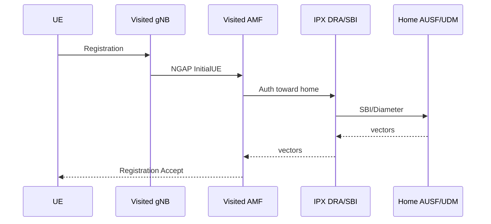

# 5G roaming registration (HR)

```mermaid
sequenceDiagram
  participant UE
  participant gNB as Visited gNB
  participant AMF as Visited AMF
  participant IPX as IPX DRA/SBI
  participant AUSF as Home AUSF/UDM
  UE->>gNB: Registration
  gNB->>AMF: NGAP InitialUE
  AMF->>IPX: Auth toward home
  IPX->>AUSF: SBI/Diameter
  AUSF-->>IPX: vectors
  IPX-->>AMF: vectors
  AMF-->>UE: Registration Accept
```
