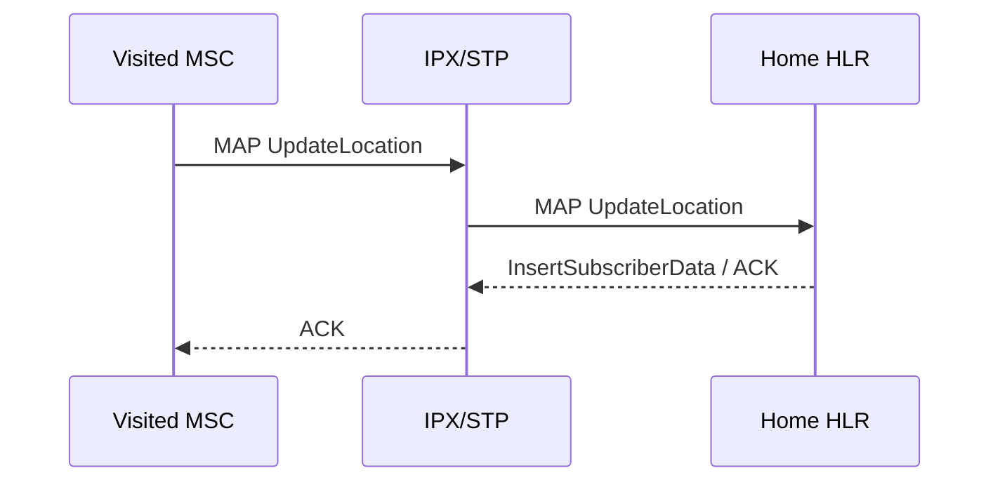

# MAP UpdateLocation (lab educational)

```mermaid
sequenceDiagram
  participant MSC as Visited MSC
  participant STP as IPX/STP
  participant HLR as Home HLR
  MSC->>STP: MAP UpdateLocation
  STP->>HLR: MAP UpdateLocation
  HLR-->>STP: InsertSubscriberData / ACK
  STP-->>MSC: ACK
```

E.212 (IMSI) ↔ E.214 (MGT) lab mapping: see `ss7-map/e212-e214-lab-map.md`.
