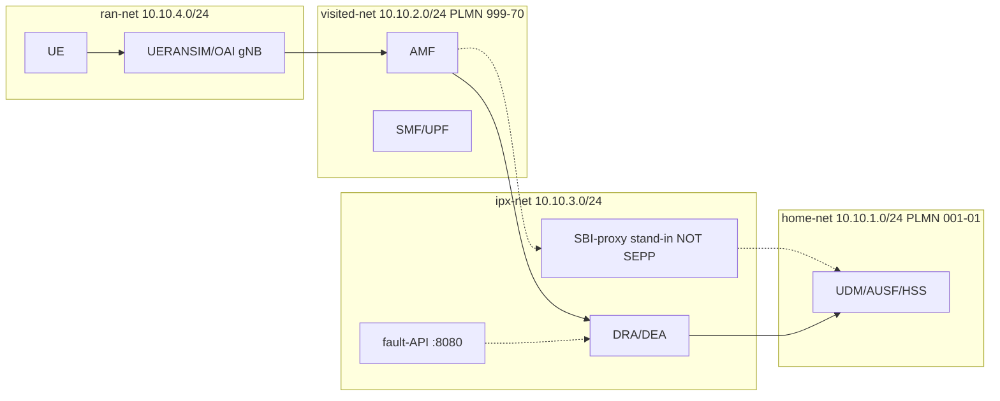

# Network plan

**Source of truth:** `network-plan.yaml` (Phase 0).

## Domains

| Network | Subnet | Role |
|---------|--------|------|
| home-net | 10.10.1.0/24 | Home PLMN 001-01 (UDM/AUSF/HSS/…) |
| visited-net | 10.10.2.0/24 | Visited PLMN 999-70 (AMF/SMF/UPF) |
| ipx-net | 10.10.3.0/24 | DRA + SBI proxy stand-in + fault API |
| ran-net | 10.10.4.0/24 | UERANSIM / OAI |
| ss7-net | 10.10.5.0/24 | Osmocom stubs |
| mocks-net | 10.10.6.0/24 | SCEF / SGd / billing |
| monitoring-net | 10.10.7.0/24 | Prometheus / Grafana / Streamlit |

## Routing rule

Home ↔ Visited **direct path blocked**. All inter-PLMN signalling via IPX. Guarded by `LAB-IREG-000`.

## Mermaid



## Host ports

Grafana 3000 | Prometheus 9090 | Streamlit 8501 | SCEF 8000 | fault-API 8080 | Home WebUI 9999 | Visited WebUI 9998 | IMSI-trace 8502

## Verification

```bash
make check-network
# Ubuntu live: scripts/enforce-ipx-routing.sh then pytest -k LAB-IREG-000
```

Status: structural checks runnable on Windows; live Docker/iptables **DEFERRED-TO-UBUNTU**.
