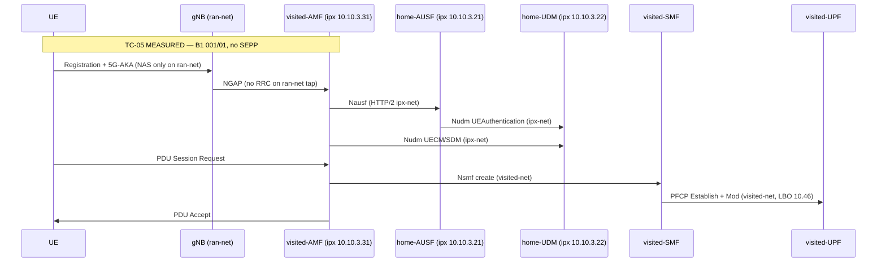

# TC-05 — 5G SA Registration from VPLMN (SUCI / 5G-AKA) — Golden Path Spec

**Status:** READY-LIVE (B1 camp MEASURED once on Ubuntu)  
**Related:** [`docs/ireg-tc-matrix.md`](../ireg-tc-matrix.md) · [`docs/call-flows/5g-sa-roaming-reference.md`](../call-flows/5g-sa-roaming-reference.md) · [`dashboard/exporters/flow_catalog.py`](../../dashboard/exporters/flow_catalog.py)  
**Refs (structure only):** TS 23.502 §4.2.2; TS 33.501 §6.1; GSMA NG.113 (member-restricted — do not claim document conformance)

---

## Lab honesty banner (read before pass/fail)

| Topic | Lab reality |
|-------|-------------|
| **Camp model** | **B1** = UE/gNB broadcast **001/01** (same PLMN); home subscriber auth via **ipx-net** dual-home SBI. **Not** true VPLMN **999/70** camp — [DEF-0014](../defect-log.md). |
| **SEPP / N32** | **Absent.** Home NFs register on `ntn-ipx-net`; SBI is direct HTTP/2 between dual-home IPs. `ipx-sbi-proxy` is a labelled stand-in — **not** N32 ([V14](../verification-register.md)). |
| **User plane** | **LBO-style visited UPF** — UE pool **10.46.0.0/16**. Default `ROAMING_MODE=LBO`. **MEASURED** `20260826T014834` TUN **10.46.0.3** + GW ping ([evidence](../evidence/TC-05-20260826T014834-LBO-MEASURED.md)). Historical `20260826T010742` **10.45.0.3** SUPERSEDED. HR **10.45** = TC-15 only ([DEF-0016](../defect-log.md)). |
| **Capture scope** | `ran-net.pcap` = **NGAP + NAS-5GS only** — **no RRC** on this tap. HTTP/2 roaming auth/UDM traffic is on **ipx-net.pcap**, not `home-net.pcap` alone. |
| **Evidence label** | **MEASURED** only from Ubuntu pcaps/logs reviewed on host. Windows scaffold = **DEFERRED-TO-UBUNTU**. |
| **Negative codes** | Do **not** hard-code NAS auth-failure cause **0x59** (or any single cause byte) as TC-05 pass oracle — this TC is the **positive** golden path. Wrong-key / barred cases are TC-03 / TC-06. |

---

## Explanation

TC-05 is the lab’s **golden attach**: 5G-AKA authentication, registration at home UDM, and an **LBO-style** PDU session anchored on visited SMF/UPF with UE address from **10.46.x**.

The procedure spans four reference flows mapped in [`5g-sa-roaming-reference.md`](../call-flows/5g-sa-roaming-reference.md):

1. **Authentication** (9 steps) — SUCI → 5G-AKA → Security Mode  
2. **Registration** (7 steps) — NRF discovery, UECM/SDM, optional policy, Registration Accept  
3. **PDU establishment (1/2)** (6 catalog steps; **3 N/A** for TC-05 HR legs) — PDU Request → vSMF → vUPF PFCP  
4. **PDU establishment (2/2)** (6 catalog steps; **3 N/A** for TC-05 HR legs) — SM policy, PFCP mod, PDU Accept, user-plane check  

### Step inventory

| Scope | Count | Notes |
|-------|------:|-------|
| **Full catalog** | **28** | All steps in [`flow_catalog.py`](../../dashboard/exporters/flow_catalog.py) `FLOW_STEPS` |
| **TC-05 expected** | **23** | Excludes 5 HR-only PDU steps marked **N/A** (`pdu-4`, `pdu-5`, `pdu-6`, `pdu-8`, `pdu-10`) |
| **Optional** | **1** | NGAP Initial Context Setup — confirm in pcap if interview depth requires RAN context delivery |

Phase breakdown for TC-05 denominator: **auth=9**, **reg=7**, **pdu=7** (see `expected_step_counts("TC-05")` in `flow_catalog.py`).

### Architecture (what B1 proves vs does not)



**Interview sound bite:** “We **MEASURED** 5G-AKA, registration, and an LBO PDU on TC-05. B1 is same-PLMN **001/01** camp with home auth over ipx-net — not production VPLMN **999/70** selection, **no SEPP**, and user plane is **10.46** visited LBO, not proven HR **10.45**.”

---

## Signalling table (full catalog + optional RAN step)

Columns map 1:1 to [`flow_catalog.py`](../../dashboard/exporters/flow_catalog.py) step IDs unless marked **optional**.

**Legend — TC-05 evidence label:** **MEASURED** = required golden-path evidence · **PARTIAL** = step in scope but confirm manually / may be absent in minimal capture · **N/A** = HR-only; excluded from TC-05 denominator.

| # | Catalog ID | Direction | Message / procedure | Spec / lab note | PCAP file | Wireshark display filter | Expected fields / oracle | TC-05 label |
|---|------------|-----------|---------------------|-----------------|-----------|--------------------------|--------------------------|-------------|
| **Flow 1 — Authentication** |
| 1 | `auth-1` | UE → gNB → AMF | Registration Request (SUCI) | TS 24.501 NAS MM; B1 SUCI `suci-0-001-01-…` — not VPLMN 999/70 (DEF-0014) | `ran-net.pcap` | `nas-5gs.mm.message_type == 0x41` | SUCI present; no plaintext SUPI on air (protectionScheme may be 0 in lab — note in NOTES.md) | MEASURED |
| 2 | `auth-2` | gNB → AMF | Initial UE Message (NAS transport) | NGAP; **no RRC** on ran-net tap | `ran-net.pcap` | `ngap && (ip.addr == 10.10.4.11 \|\| ip.addr == 10.10.2.11)` | NGAP Initial UE Message carrying NAS PDU | MEASURED |
| 2opt | — *(optional)* | AMF → gNB | Initial Context Setup | TS 38.413; procedure code filter **UNVERIFIED** ([V26](../verification-register.md)) | `ran-net.pcap` | `ngap.procedureCode == 15` **UNVERIFIED** | Downlink NAS transport / security context delivery — optional interview depth | PARTIAL |
| 3 | `auth-3` | AMF → AUSF | Nausf_UEAuthentication **create** | TS 29.509; no SEPP — direct ipx-net SBI (V14) | `ipx-net.pcap` | `http2 && ip.addr == 10.10.3.31 && ip.addr == 10.10.3.21 && frame contains "/nausf-auth/v1/ue-authentications"` | `POST /nausf-auth/v1/ue-authentications`; HTTP **2xx** | MEASURED |
| 4 | `auth-4` | AUSF → UDM | Nudm_UEAuthentication_Get | TS 29.503; exact GET path suffix **UNVERIFIED** | `ipx-net.pcap` | `http2 && ip.addr == 10.10.3.21 && ip.addr == 10.10.3.22 && frame contains "/nudm-ueau/v1/"` | Auth subscription / vector fetch; HTTP **2xx** | MEASURED |
| 5 | `auth-5` | UDM → UDR | Nudr_DR (auth subscription) | TS 29.504 `/nudr-dr/v2/` resource paths **UNVERIFIED** | `ipx-net.pcap` | `http2 && ip.addr == 10.10.3.22 && ip.addr == 10.10.3.24 && frame contains "/nudr-dr/v2/"` | Subscription data read for auth; HTTP **2xx** | MEASURED |
| 6 | `auth-6` | AMF → UE | 5G-AKA challenge (RAND/AUTN) | TS 33.501 §6.1 | `ran-net.pcap` | `nas-5gs` | Authentication Request with 5G-AKA parameters | MEASURED |
| 7 | `auth-7` | UE → AMF | Authentication Response | TS 24.501 | `ran-net.pcap` | `nas-5gs.mm.message_type == 0x57` | Valid RES*; **do not** require absence of cause 0x59 on this positive TC | MEASURED |
| 8 | `auth-8` | AMF → AUSF | Nausf_UEAuthentication **confirm** | TS 29.509; confirm URI suffix **UNVERIFIED** | `ipx-net.pcap` | `http2 && ip.addr == 10.10.3.31 && ip.addr == 10.10.3.21 && frame contains "5g-aka-confirmation"` | `PUT …/5g-aka-confirmation`; HTTP **2xx**; no 404 on `suci-0-001-01-…` | MEASURED |
| 9 | `auth-9` | AMF ↔ UE | Security Mode Command / Complete | TS 24.501 | `ran-net.pcap` | `nas-5gs \|\| ngap` | Security Mode Complete after successful AKA | MEASURED |
| **Flow 2 — Registration** |
| 10 | `reg-1` | AMF → NRF | NF discovery (AUSF/UDM/PCF) | TS 29.510 **NRF NFM** — use `/nnrf-nfm/v1/nf-instances`, **not** `nnrf-disc` | `ipx-net.pcap` (primary), `visited-net.pcap` | `http2 && frame contains "/nnrf-nfm/v1/nf-instances"` | NF profile query/register; visited NRF **10.10.3.30** | MEASURED |
| 11 | `reg-2` | AMF → UDM | Nudm_UECM_Registration | TS 29.503; path suffix **UNVERIFIED** | `ipx-net.pcap` (primary), `visited-net.pcap`, `home-net.pcap` | `http2 && ip.addr == 10.10.3.31 && ip.addr == 10.10.3.22 && frame contains "/nudm-uecm/v1/"` | `PUT …/registrations/amf-3gpp-access`; HTTP **2xx**; roaming reg at **home** UDM | MEASURED |
| 12 | `reg-3` | AMF → UDM | Nudm_SDM_Get | TS 29.503 **`/nudm-sdm/v1/`** — **not v2** | `ipx-net.pcap` (primary), `visited-net.pcap`, `home-net.pcap` | `http2 && frame contains "/nudm-sdm/v1/"` | `GET` subscription data; slice/DNN from home profile; HTTP **2xx** | MEASURED |
| 13 | `reg-4` | AMF → UDM | Nudm_SDM_Subscribe | TS 29.503; POST body **UNVERIFIED** | `ipx-net.pcap` (primary), `visited-net.pcap`, `home-net.pcap` | `http2 && frame contains "sdm-subscriptions"` | `POST …/sdm-subscriptions`; confirm in pcap if interview depth requires | PARTIAL |
| 14 | `reg-5` | UDM → UDR | Nudr_DR (UE context / registration) | TS 29.504 | `ipx-net.pcap` | `http2 && ip.addr == 10.10.3.22 && ip.addr == 10.10.3.24 && frame contains "/nudr-dr/v2/"` | UECM/SDM persistence via UDR; HTTP **2xx** | MEASURED |
| 15 | `reg-6` | AMF → PCF | Npcf_AMPolicyControl | TS 29.507; path **UNVERIFIED** | `ipx-net.pcap` | `http2 && ip.addr == 10.10.3.25 && frame contains "/npcf-am-policy-control/"` | AM policy association if triggered; may be absent in minimal attach | PARTIAL |
| 16 | `reg-7` | AMF → UE | Registration Accept | TS 24.501 | `ran-net.pcap` | `nas-5gs.mm.message_type == 0x42` | UE **MM-REGISTERED**; 5GS registration result success | MEASURED |
| **Flow 3 — PDU Session Establishment (1/2)** |
| 17 | `pdu-1` | UE → AMF | PDU Session Establishment Request | TS 24.501 5GSM | `ran-net.pcap` | `nas-5gs.sm.message_type == 0xc1` | DNN `internet` (default UE YAML) | MEASURED |
| 18 | `pdu-2` | AMF → vSMF | Nsmf_PDUSession create SM context | TS 29.502 | `visited-net.pcap` | `http2 && ip.addr == 10.10.2.11 && ip.addr == 10.10.2.12 && frame contains "/nsmf-pdusession/v1/sm-contexts"` | `POST` SM context; HTTP **2xx** | MEASURED |
| 19 | `pdu-3` | vSMF → vUPF | PFCP Session Establishment | TS 29.244 | `visited-net.pcap` | `pfcp && (ip.addr == 10.10.2.12 \|\| ip.addr == 10.10.2.13)` | PFCP Session Establishment Request/Response; **LBO** anchor on visited UPF | MEASURED |
| 20 | `pdu-4` | vSMF → hSMF | Nsmf_PDUSession create (HR / N16) | TS 23.502 HR — **TC-05 skips** (DEF-0016) | `ipx-net.pcap`, `visited-net.pcap` | `http2 && frame contains "/nsmf-pdusession/"` | HR only — see TC-15 | **N/A** |
| 21 | `pdu-5` | hSMF → UDM | Nudm session (UECM/SDM) | HR session binding | `home-net.pcap`, `ipx-net.pcap` | `http2 && frame contains "/nudm-"` | HR only | **N/A** |
| 22 | `pdu-6` | UDM → UDR | Nudr_DR (session subscription) | HR session profile | `home-net.pcap` | `http2 && frame contains "/nudr-dr/v2/"` | HR only | **N/A** |
| **Flow 4 — PDU Session Establishment (2/2)** |
| 23 | `pdu-7` | vSMF → PCF | Npcf_SMPolicyControl create | TS 29.512 | `ipx-net.pcap`, `visited-net.pcap` | `http2 && frame contains "/npcf-smpolicycontrol/v1/sm-policies"` | SM policy create; may use home PCF **10.10.3.25** — confirm in pcap | PARTIAL |
| 24 | `pdu-8` | hSMF → hUPF | PFCP Session Establishment (hUPF) | HR user plane — pool **10.45.0.0/16** | `home-net.pcap` | `pfcp && (ip.addr == 10.10.1.23 \|\| ip.addr == 10.10.1.24)` | HR only — TC-15 | **N/A** |
| 25 | `pdu-9` | vSMF → vUPF | PFCP Session Modification (vUPF / N3) | TS 29.244; msg_type **50/51 UNVERIFIED** ([V27](../verification-register.md)) | `visited-net.pcap` | `pfcp && (ip.addr == 10.10.2.12 \|\| ip.addr == 10.10.2.13)` — optional refine: `pfcp.msg_type == 50 \|\| pfcp.msg_type == 51` **UNVERIFIED** | PFCP Modification Request/Response after SM context programming | MEASURED |
| 26 | `pdu-10` | vSMF ↔ hSMF | N4 / N9 HR coordination | N9 in Open5GS **UNVERIFIED** (V25) | `visited-net.pcap`, `home-net.pcap` | `pfcp \|\| gtp` | HR only | **N/A** |
| 27 | `pdu-11` | AMF → UE | PDU Session Establishment Accept | TS 24.501 5GSM | `ran-net.pcap` | `nas-5gs.sm.message_type == 0xc2` | PDU session ID assigned; UE log “PDU session establishment successful” | MEASURED |
| 28 | `pdu-12` | UE → vUPF GW | User-plane check (LBO **10.46**) | Lab honesty: **visited LBO**, not HR **10.45** | `visited-net.pcap` | `icmp && ip.addr == 10.46.0.5` (adjust to captured UE IP) | `uesimtun0` **10.46.x**; ping GW **10.46.0.1** OK; DN **8.8.8.8** fail expected (DEF-0015) | MEASURED |

**Row count:** 28 catalog steps + 1 optional = **29 rows** in table; **23** steps count toward TC-05 coverage ratio.

---

## NF anchor IPs (capture orientation)

| NF | Container | visited-net / home-net | ipx-net (dual-home) |
|----|-----------|------------------------|---------------------|
| Visited AMF | `visited-amf` | 10.10.2.11 (+ 10.10.4.11 ran) | **10.10.3.31** |
| Visited SMF / UPF | `visited-smf` / `visited-upf` | 10.10.2.12 / 10.10.2.13 | — |
| Visited NRF | `visited-nrf` | 10.10.2.10 | **10.10.3.30** |
| Home AUSF / UDM / UDR | `home-ausf` / `home-udm` / `home-udr` | 10.10.1.11 / .12 / .13 | **10.10.3.21 / .22 / .24** |
| Home PCF | `home-pcf` | 10.10.1.15 | **10.10.3.25** |

UE pools: **LBO** `10.46.0.0/16` (TC-05 MEASURED) · **HR** `10.45.0.0/16` (TC-15 target, unproven).

---

## Capture layout & workflow

**Output:** `pcaps/TC-05/<YYYYMMDDTHHMMSS>/`

| Artifact | Path |
|----------|------|
| RAN (NGAP/NAS only — **no RRC**) | `ran-net.pcap` |
| Visited PLMN SBI/N4 | `visited-net.pcap` |
| Home PLMN (secondary for some UDM legs) | `home-net.pcap` |
| IPX / dual-home SBI (**primary for auth + UDM**) | `ipx-net.pcap` |
| NF logs | `docker-logs/{visited-amf,home-ausf,…}.log` |
| Interview checklist | `NOTES.md` |

```bash
# Ubuntu golden path
bash scripts/capture-ireg-tc.sh TC-05
export UERANSIM_BIN=~/UERANSIM/build ATTACH_MODE=b1-home-plmn KEEP_UE=1
sudo -E bash scripts/live-first-attach.sh
bash scripts/capture-ireg-tc.sh TC-05 --stop
bash scripts/refresh-flow-dashboard.sh TC-05   # optional Grafana ladder
```

---

## Verdict rules (PASS / PARTIAL / FAIL)

### PASS (golden TC-05)

All of the following, with evidence paths recorded in `NOTES.md`:

| Gate | Check |
|------|-------|
| **Identity** | SUCI `suci-0-001-01-0000-0-0-0000000001` in AMF log (not `999-70`) |
| **Auth chain** | Steps `auth-3`…`auth-5`, `auth-8` visible on **`ipx-net.pcap`** with HTTP **2xx** (not only `home-net.pcap`) |
| **Registration** | `reg-1` NRF path contains **`/nnrf-nfm/v1/nf-instances`**; `reg-2`/`reg-3` on **`/nudm-uecm/v1/`** and **`/nudm-sdm/v1/`**; `reg-7` Registration Accept |
| **PDU (LBO)** | `pdu-1`…`pdu-3`, `pdu-9`, `pdu-11` MEASURED; user plane **`10.46.x`** + GW ping OK |
| **Coverage** | ≥ **23/23** TC-05-expected steps observed (per `total_expected_steps("TC-05")`) |
| **Honesty** | NOTES.md acknowledges B1 **001/01**, **no SEPP**, **LBO 10.46** |

**PARTIAL-labeled steps (`reg-4`, `reg-6`, `pdu-7`)** do not block PASS if absent, but must be listed as “not observed” in NOTES.md.

### PARTIAL

Any of:

- Registration or PDU succeeds but **&lt; 23/23** expected steps observed (missing MEASURED-step pcaps/filters)  
- Auth/UDM traffic found only on `home-net.pcap` but attach succeeded — dual-home path not demonstrated in capture  
- `reg-4`, `reg-6`, or `pdu-7` missing while all **MEASURED**-label steps present  
- Windows scaffold / DEFERRED-TO-UBUNTU — no host-reviewed pcaps  
- UE registered but PDU failed or `uesimtun0` not **10.46.x**

### FAIL

Any of:

- Authentication or registration rejected (UE not **MM-REGISTERED**)  
- AUSF/UDM HTTP **4xx/5xx** on golden subscriber (e.g. 404 on `suci-0-001-01-…`)  
- No ipx-net auth/UDM traffic when attach claimed as roaming golden path  
- Wrong subscriber / wrong-key behaviour (that is **TC-03**, not TC-05)  
- Claiming HR **10.45.x** or hSMF/hUPF path under TC-05 (mis-labelled — use TC-15)

**Do not FAIL TC-05** solely because:

- NAS auth-failure cause **0x59** is absent (positive TC — failure causes belong to negative TCs)  
- SDM Subscribe or AM/SM policy steps missing (those are **PARTIAL** by design)  
- Optional Initial Context Setup (`ngap.procedureCode == 15`) not seen  

---

## Grafana / exporter cross-reference

The PCAP flow exporter and Grafana ladder use [`dashboard/exporters/flow_catalog.py`](../../dashboard/exporters/flow_catalog.py) step IDs (`auth-1` … `pdu-12`).

| Function | Purpose |
|----------|---------|
| `FLOW_STEPS` | Canonical 28-step catalog |
| `expected_step_counts("TC-05")` | `{auth: 9, reg: 7, pdu: 7}` |
| `total_expected_steps("TC-05")` | **23** |
| `is_expected_for_tc(step, "TC-05")` | False for `pdu-4`, `pdu-5`, `pdu-6`, `pdu-8`, `pdu-10` |
| `expected_label(step, "TC-05")` | Returns `tc05_label` column (MEASURED / PARTIAL / N/A) |

Offline fixture: `dashboard/exporters/fixtures/tc05_minimal_ladder.json`  
Runbook: [`docs/runbooks/grafana-5g-flow.md`](../runbooks/grafana-5g-flow.md)

---

## Architecture honesty checklist (copy to `NOTES.md`)

- [ ] **Camp model:** B1 same-PLMN **001/01** — **not** true VPLMN **999/70** (DEF-0014)  
- [ ] **SEPP/N32:** **ABSENT** — dual-home SBI / proxy stand-in only (V14)  
- [ ] **User plane:** ☑ LBO **10.46** (MEASURED default) ☐ HR **10.45** (TC-15 only)  
- [ ] **SUCI:** `suci-0-001-01-0000-0-0-0000000001`  
- [ ] **Auth+reg:** home AUSF/UDM/UDR **2xx on ipx-net** (not home-net alone)  
- [ ] **PDU:** visited SMF/UPF anchor; HR legs **N/A** for TC-05  
- [ ] **RRC:** not expected on `ran-net.pcap`  
- [ ] **Result:** PASS / PARTIAL / FAIL  
- [ ] **MEASURED files:** list pcap + log paths reviewed  
